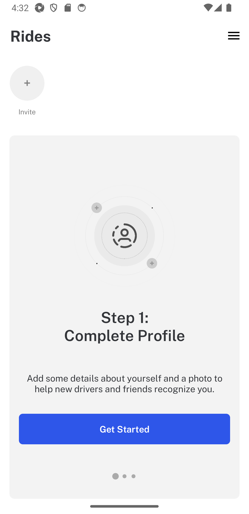

# James Rider Test FW

# Pre-requisites
Follow along all the necessary configuration for each of the below pre-requisites, including global variables.
- Terminal of choice, as [WARP](https://www.warp.dev/)
- Python 3
- Install [Node.js](https://nodejs.org/en)
- Install [Appium](https://appium.io/docs/en/latest/quickstart/install/)
  - [UiAutomator2](https://appium.io/docs/en/latest/quickstart/uiauto2-driver/)
- Install  [Android Studio](https://developer.android.com/studio?hl=es-419) and SDK.
- [Appium Inspector](https://github.com/appium/appium-inspector/releases) this is optional, but needed when building tests.

# Setup

1. `python3 -m venv env_name`
2. `source env_name/bin/activate`
3. `pip3 install -r requirements.txt`
4. Make sure you open the Android Emulator and had connected your real device or emulator turned on

# Code Structure

# How to run test
- In order to execute all tests type `behave` in terminal. 

### Reporting
- With Allure report, execute this command in  `behave -f allure_behave.formatter:AllureFormatter -o "reports" features/tests/[FEATURE_TO_RUN]_test.feature`

### Comments
- In order to execute tests related to profile, you need to follow the next steps:
  1. Open `environment.py` and comment line 13 `"appium:noReset": "true",` 
  2. Execute the test, it will fail.
  3. Follow all the steps in the app to reach the `Rides` screen.
  4. Uncomment line in step 1, and execute the test again.

## TO DOs
1. "Dockerizing" the fw
2. Ask DEV possibilities to avoid/remove 6-Digit code in testing stage.
3. Add some code improvements.
4. Please notice that, no branching strategy was followed but that can be applied with ease.

## Extras
#### Issues you may encounter
| Problem                                                                                                                                                                         |                                                                Solution                                                                | 
|---------------------------------------------------------------------------------------------------------------------------------------------------------------------------------|:--------------------------------------------------------------------------------------------------------------------------------------:|
| ADB not found                                                                                                                                                                   | Need to be added to the path: https://dev.to/ravics09/solution-of-command-not-found-adb-error-29e7; Get device name with `adb devices` |
| Loading the APK                                                                                                                                                                 |                                          Drag and Drop or go to `File > Profile or Debug APK`                                          |
| Error `UnknownMethodException: Message: The requested resource could not be found, or a request was received using an HTTP method that is not supported by the mapped resource` |               Downgraded Appium & Selenium latest to on previous, and removed `wd/hub` from URL in desired capabilities                |

  